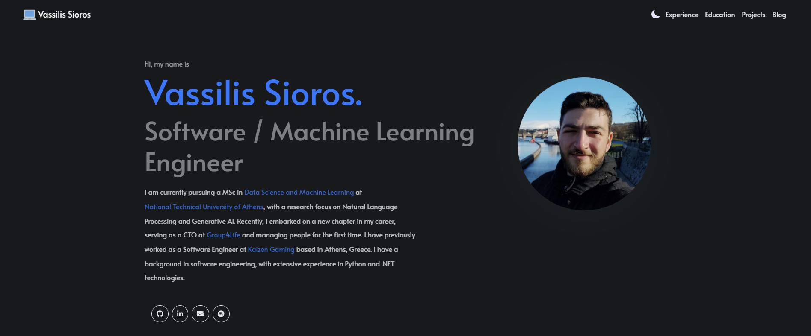

<h1>Hey 👋, I'm <a href="https://www.linkedin.com/in/vassilis-sioros/">Vassilis</a></h1>

I am currently pursuing a MSc in [Data Science and Machine Learning](https://dsml.ece.ntua.gr/) at [**National Technical University of Athens**](https://www.ntua.gr/en), with a research focus on Natural Language Processing and Generative AI. Recently, I embarked on a new chapter in my career, serving as a CTO at [**Group4Life**](https://www.group4life.com) and managing people for the first time. I have previously worked as a Software Engineer at [Kaizen Gaming](https://kaizengaming.com) based in Athens, Greece. I have a background in software engineering, with extensive experience in Python and .NET technologies.

 

- 💼 Reach out to me via <a href="mailto:billsioros97@gmail.com">email.</a>
- 💬 Ping me about Python, FastAPI, ML, and NLP stuff.
- 📙 Check out my <a href="https://www.linkedin.com/in/vassilis-sioros/overlay/1635546868832/single-media-viewer/?profileId=ACoAACoGfP0BLlUSc-EZFLGz-STknzi8va8pwRE">resume</a>.

## 🌟 Featured Projects

- **[RoughGAN](https://github.com/billsioros/RoughGAN)**: In this work, we look at how a Generative Adversarial Network (GAN)-based strategy, given a nanorough surface data set, may learn to produce nanorough surface samples that are statistically equivalent to the ones belonging to the training data set. We also look at how combining the GAN framework with a variety of nanorough similarity measures might improve the realisticity of the synthesized nanorough surfaces. We showcase via multiple experiments that our framework is able to produce sufficiently realistic nanorough surfaces, in many cases indistinguishable from real ones. Accompanying code for the paper [**Generating Realistic Nanorough Surfaces Using an N-Gram-Graph Augmented Deep Convolutional Generative Adversarial Network**](https://dl.acm.org/doi/fullHtml/10.1145/3549737.3549794) presented at [**SETN 2022**](https://hilab.di.ionio.gr/setn2022/).
- **[HeartBeat :heartbeat:](https://github.com/billsioros/heartbeat)**: People with cardiovascular disease or who are at high cardiovascular risk (due to the presence of one or more risk factors such as hypertension, diabetes, hyperlipidaemia or already established disease) need early detection and management wherein a machine learning model can be of great help. In this project, we create a complete solution featuring a [`FastAPI`](https://fastapi.tiangolo.com/) backend and a [`React`](https://react.dev/) frontend. We perform Exploratory Data Analysis (EDA) and develop a machine learning model using [`scikit-learn`](https://scikit-learn.org).

  

    
    
  

